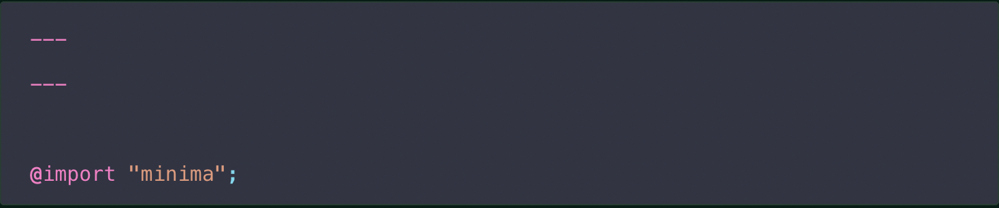
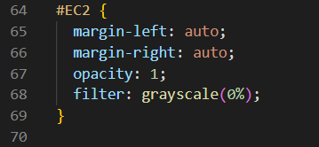
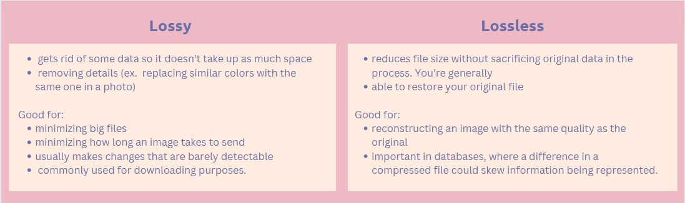

<html>
  <head>
    <link rel="stylesheet" href="page1.css">
    <link rel="stylesheet" href="https://fonts.googleapis.com/icon?family=Material+Icons">
  </head>
  <body>
    <button id="dark" onclick="darkMode()">Dark Mode</button>
    <h3></h3>
    <h4><i class="material-icons">favorite</i>click on each topic to learn more!<i class="material-icons">favorite</i></h4>
        

        <button onclick="visibility()">Basic User Interface (UI) Properties</button>
        

        

        <h2>Properties:</h2>
    

        <ul>
          <li>Color: This refers to the hue, saturation, and brightness of the UI elements such as background, text, buttons, etc.</li>
            <a href="https://htmlcolorcodes.com/">HTML Color Codes</a> 
            
              
          <li>Font: This refers to the typeface, size, weight, and style of the text displayed on the UI.</li>
            <a href="https://www.w3schools.com/css/css_font.asp">HTML Fonts</a> 
            
              
          <li>Layout: This refers to the arrangement and positioning of UI elements such as buttons, text boxes, images, etc</li>
            
Make wireframes to plan Layout!

            
Resources: canva

              
          <li>Icons: These are small graphical symbols used to represent actions or ideas in the UI.</li>
              
          <li>Interactivity: This refers to how the UI responds to user actions, such as clicking, tapping, dragging, and scrolling.</li>
              
          <li>Accessibility: This refers to the ability of the UI to be used by people with disabilities, such as support for screen readers, keyboard navigation, and color contrast.</li>
        </ul>
       
      
Identify all these properties on this page

    

        

        

        <button onclick="visibility2()">Adding/Changing Colors</button>
        

    

        <h2>Changing Text and Background Color:</h2>
        

    Programming languages: To change the color of text, you will need to know how to write code in a programming language that supports text formatting. Some common programming languages that support this include HTML, CSS, JavaScript, and Python.
      
    Color codes: To change the color of text, you will need to know the hexadecimal or RGB color code for the color you want to use. The hexadecimal code is a six-digit code that represents the red, green, and blue values of a color, while the RGB code represents the red, green, and blue values as integers between 0 and 255.
      
    CSS syntax: If you are using CSS to change the color of text, you will need to know the syntax for defining styles for HTML elements. This includes understanding the selector, property, and value syntax used in CSS.
      
    HTML structure: To change the color of text in HTML, you will need to understand the basic structure of an HTML document and how to add styles to individual elements using inline styles or external style sheets.
     
    

    
    
    <h2>Themes</h2>
    

    1. Create a file called /assets/css/style.scss in your site
      
    2. Add the following content to the top of the file, exactly as shown: 
    
      
    3. Add any custom CSS (or Sass, including imports) you’d like immediately after the @import line
      
    Stylesheets: To change the visual appearance of an application or platform, you may need to modify the stylesheets that control the presentation of the user interface elements. This may involve editing existing styles or creating new ones.
      
    Configuration files: Some applications and platforms may have configuration files that control the behavior and appearance of the application. To change the theme, you may need to modify these configuration files.
     
    

    

      

    <button onclick="visibility3()">Images</button>
    

    

    

      <h2>Styling Images (No Animation)</h2>
        - rounded corners on images and buttons
        - center
        - opacity
        - grayscale
      
      <h2>Other Things You Need to Know for the AP Exam</h2>
      <h5>Data Compression</h5>
        
          
      <h5>base 64</h5>
        Binary data: Base64 is used to encode binary data, such as images, audio, and video files. You will need to understand how binary data is represented and stored in computing systems.
          
        ASCII encoding: Base64 converts binary data into ASCII text format, which can be transmitted and stored more easily than binary data. You will need to understand ASCII encoding and how it works.
          
        Encoding process: Base64 encodes binary data by splitting it into 6-bit chunks and encoding each chunk as a single character in the Base64 character set. You will need to understand how this encoding process works.
          
        Decoding process: Base64 also includes a decoding process that converts Base64-encoded text back into binary data. You will need to understand how this decoding process works.
    

    

        

        <button onclick="visibility4()">Importance of Wireframes</button>
        

        

        <h2>Properties:</h2>
    
    

    
