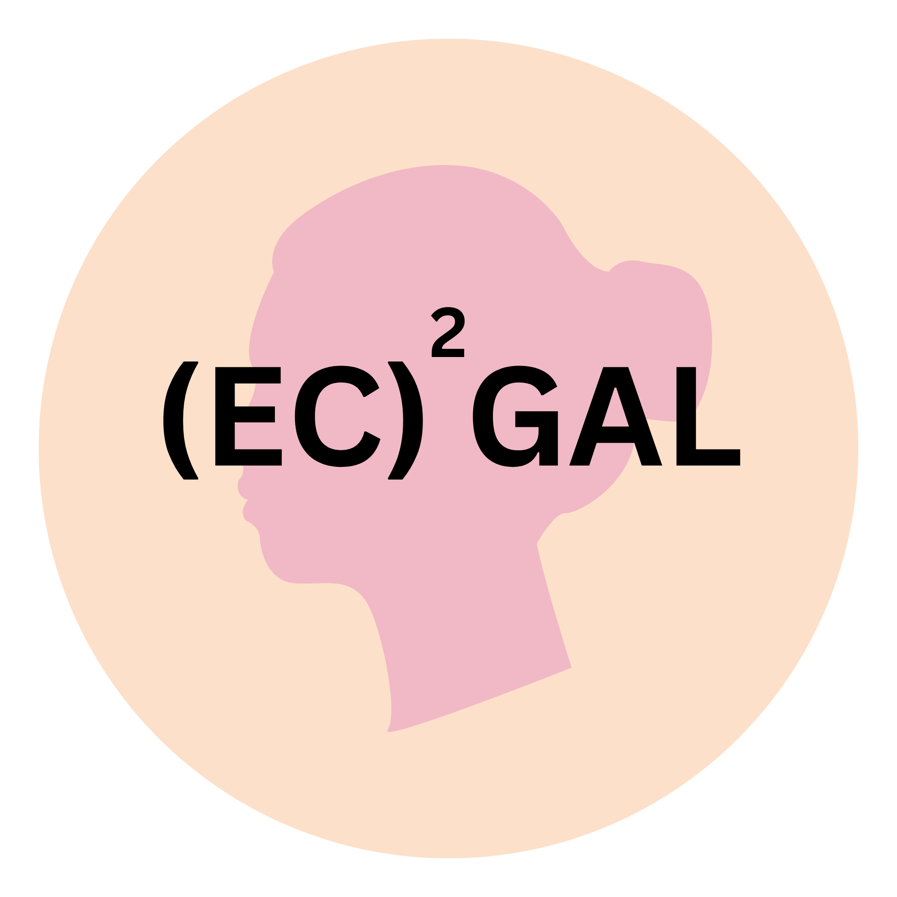
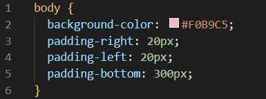
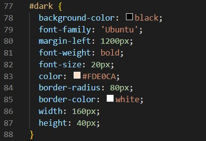
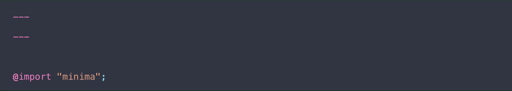
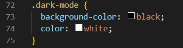
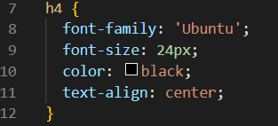
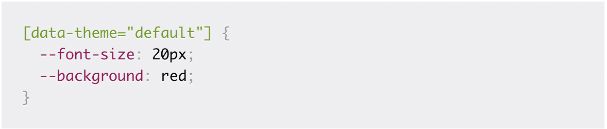
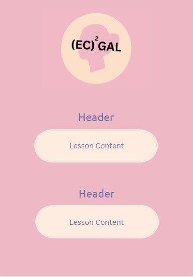

<html>
  <head>
    <link rel="stylesheet" href="page1.css">
    <link rel="stylesheet" href="https://fonts.googleapis.com/icon?family=Material+Icons">
  </head>
  <body>
    <button id="dark" onclick="darkMode()">Dark Mode</button>
    <h3></h3>
    <h4><i class="material-icons">favorite</i>click on each topic to learn more!<i class="material-icons">favorite</i></h4>
        

        <button onclick="visibility()">Basic User Interface (UI) Properties</button>
        

        

        <h2>Properties:</h2>
    

<<<<<<< HEAD
Programming languages: To change the color of text, you will need to know how to write code in a programming language that supports text formatting. Some common programming languages that support this include HTML, CSS, JavaScript, and Python.
  
Color codes: To change the color of text, you will need to know the hexadecimal or RGB color code for the color you want to use. The hexadecimal code is a six-digit code that represents the red, green, and blue values of a color, while the RGB code represents the red, green, and blue values as integers between 0 and 255.
  
CSS syntax: If you are using CSS to change the color of text, you will need to know the syntax for defining styles for HTML elements. This includes understanding the selector, property, and value syntax used in CSS.
  
HTML structure: To change the color of text in HTML, you will need to understand the basic structure of an HTML document and how to add styles to individual elements using inline styles or external style sheets.
 

<h2>Themes</h2>

1. Navigate or create your /assets/css/style.scss in your site

  
2. Add the following content to the top of the file, exactly as shown: 

  
3. Add any custom CSS (or Sass, including imports) you’d like immediately after the @import line
  
Stylesheets: To change the visual appearance of an application or platform, you may need to modify the stylesheets that control the presentation of the user interface elements. This may involve editing existing styles or creating new ones.
  
Configuration files: Some applications and platforms may have configuration files that control the behavior and appearance of the application. To change the theme, you may need to modify these configuration files.
 

  

<button onclick="visibility3()">Images</button>

    <h2>Data Compression</h2>
=======
        <ul>
          <li>Color: This refers to the hue, saturation, and brightness of the UI elements such as background, text, buttons, etc.</li>
            
Resources: https://htmlcolorcodes.com/

            
              
          <li>Font: This refers to the typeface, size, weight, and style of the text displayed on the UI.</li>
            
Resources: https://www.w3schools.com/css/css_font.asp

            
              
          <li>Layout: This refers to the arrangement and positioning of UI elements such as buttons, text boxes, images, etc</li>
            
Make wireframes to plan Layout!

            
Resources: canva

              
          <li>Icons: These are small graphical symbols used to represent actions or ideas in the UI.</li>
              
          <li>Interactivity: This refers to how the UI responds to user actions, such as clicking, tapping, dragging, and scrolling.</li>
              
          <li>Accessibility: This refers to the ability of the UI to be used by people with disabilities, such as support for screen readers, keyboard navigation, and color contrast.</li>
        </ul>
       
      
Identify all these properties on this page

    

        

        

        <button onclick="visibility2()">Adding/Changing Colors</button>
        

    

        <h2>Changing Text and Background Color:</h2>
        

        Themeing: giving users the ablilty to make customizations to our websites and apps. 
     
     - ex: fonts, font size, color schemes, layouts, and asthetics
      
      Theme properties: set of CSS custom properties that make up a theme. 
     
       
      
    In this example, [data-theme="default"] is the theme, containing all the CSS custom properties inside the theme prop9nnnnerties. 
      
    
    

    
    
    <h2>Themes</h2>
 

    Programming languages: To change the color of text, you will need to know how to write code in a programming language that supports text formatting. Some common programming languages that support this include HTML, CSS, JavaScript, and Python.
    
    Color codes: To change the color of text, you will need to know the hexadecimal or RGB color code for the color you want to use. The hexadecimal code is a six-digit code that represents the red, green, and blue values of a color, while the RGB code represents the red, green, and blue values as integers between 0 and 255.
   
    CSS syntax: If you are using CSS to change the color of text, you will need to know the syntax for defining styles for HTML elements. This includes understanding the selector, property, and value syntax used in CSS.
      
    HTML structure: To change the color of text in HTML, you will need to understand the basic structure of an HTML document and how to add styles to individual elements using inline styles or external style sheets.
     
    

    

      

    <button onclick="visibility3()">Images</button>
    

    

        <h2>Data Compression</h2>
        

    Data representation: Before compressing data, you will need to understand how data is represented and stored. This includes knowledge of data types, encoding, and file formats.
      
    Lossy vs. lossless compression: There are two main types of data compression: lossy and lossless. Lossy compression sacrifices some amount of data fidelity to achieve higher compression ratios, while lossless compression preserves all the data without loss but typically achieves lower compression ratios.
      
    Compression algorithms: There are many compression algorithms available, including Huffman coding, Lempel-Ziv-Welch (LZW) compression, and Run-Length Encoding (RLE), each with their own strengths and weaknesses.
      
    Compression formats: Many file formats support compression, such as ZIP, GZIP, and TAR. Each format may use a different algorithm and have different compression and decompression tools available.
      
    Performance and trade-offs: The performance of compression algorithms and formats can vary greatly depending on the type of data being compressed, the amount of compression desired, and the resources available for compression and decompression. There are often trade-offs between compression ratio, compression and decompression speed, and resource requirements.
     
    

    <h2>PIL</h2>
    

    Python: PIL is a Python library, so you will need to have a basic understanding of Python programming concepts, including syntax, data types, and control structures.

    
    Image processing: PIL provides a range of image processing functions, including resizing, cropping, rotation, and color adjustments. To use PIL effectively, you will need to understand these functions and how to apply them to images.

    
    Image formats: PIL supports many image formats, including JPEG, PNG, BMP, and GIF. You will need to understand how to load and save images in these formats using PIL.

     
    Compression formats: Many file formats support compression, such as ZIP, GZIP, and TAR. Each format may use a different algorithm and have different compression and decompression tools available.
      
    Image manipulation: PIL provides tools for manipulating images pixel by pixel. To use these tools effectively, you will need to understand image data representation, including color channels, pixel depth, and image dimensions.
      
    Image analysis: PIL can also be used for image analysis tasks, such as image segmentation and feature detection. To use PIL for these tasks, you will need to understand image processing algorithms and techniques.

   
    

        <h2>numpy</h2>
        

    Python: NumPy is a Python library, so you will need to have a basic understanding of Python programming concepts, including syntax, data types, and control structures.

    
    Arrays: NumPy provides powerful tools for working with arrays, including creating arrays, indexing and slicing arrays, and performing operations on arrays.

    
    Data types: NumPy supports a wide range of data types, including integers, floats, and complex numbers, with various precision levels.

    
    Broadcasting: NumPy provides a powerful feature called broadcasting, which allows arrays with different shapes to be combined in arithmetic operations.

    
    Linear algebra: NumPy includes a range of linear algebra functions, including matrix multiplication, decomposition, and eigenvector calculation.
     
    

    <h2>base 64</h2>
    

    Binary data: Base64 is used to encode binary data, such as images, audio, and video files. You will need to understand how binary data is represented and stored in computing systems.

    
    ASCII encoding: Base64 converts binary data into ASCII text format, which can be transmitted and stored more easily than binary data. You will need to understand ASCII encoding and how it works.

    
    Encoding process: Base64 encodes binary data by splitting it into 6-bit chunks and encoding each chunk as a single character in the Base64 character set. You will need to understand how this encoding process works.

    
    Decoding process: Base64 also includes a decoding process that converts Base64-encoded text back into binary data. You will need to understand how this decoding process works.

    
    Applications: Base64 is used in many applications, including email attachments, image and video uploads on websites, and data transmission over HTTP. You will need to understand how Base64 is used in these applications.
     
    

    <h2>io</h2>
    

    Python: The io module is part of the Python standard library, so you will need to have a basic understanding of Python programming concepts, including syntax, data types, and control structures.

    
    File handling: The io module provides tools for working with files, including reading and writing data to files, opening and closing files, and navigating file directories.

    
    Text and binary modes: The io module supports both text and binary modes for file handling. You will need to understand the differences between these modes and when to use each mode.

    
    Streams: The io module provides tools for working with streams, which are used for input/output operations on data. You will need to understand how streams work and how to use them for different applications.

    
    Error handling: The io module provides tools for handling errors that may occur during input/output operations. You will need to understand how to handle errors and exceptions that may occur when working with files and streams.

   
    

    

        

        <button onclick="visibility4()">Importance of Wireframes</button>
        

        

        <h2>Properties:</h2>
    
    

    
