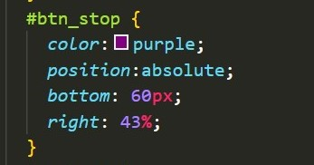
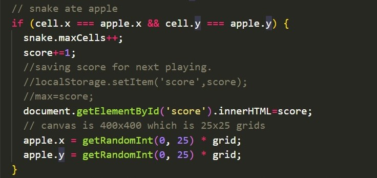
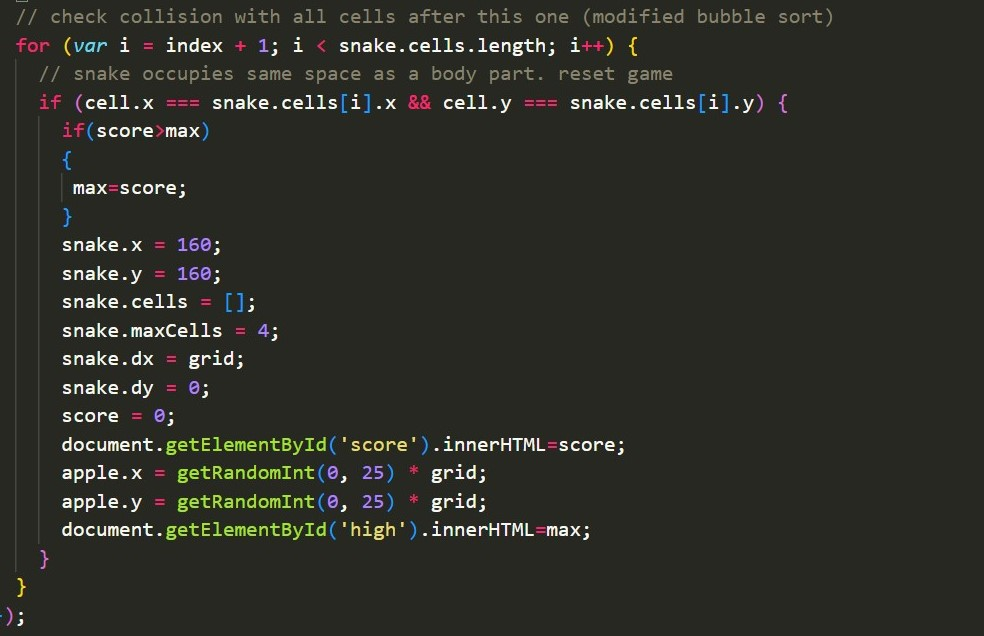
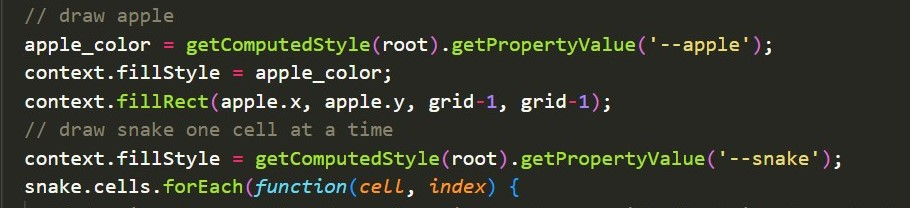
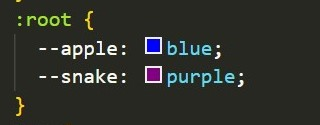

<html>
    <head>
    <link rel="stylesheet" href="snake.css">
    </head>
    <body>
    

         
        <h1>Constructing + Customizing a Javascript Snake Game!</h1>
         
        <h2>Construction - HTML</h2>
        
The order that you write code from top to bottom in the HTML file is the same order that it will appear on the website, UNLESS you change its position in CSS:
         
        <table>
            <tr>
                <td>
                    <h4>HTML:</h4>
                    

                    
                    

                     
                    <h4>CSS:</h4>
                    

                    
                    

                    

                    
                    

                </td>
                <td>
                    
 &#8680;

                </td>
                <td>
                    
                </td>
            </tr>
        </table>
        

        <h3>Functions - JavaScript</h3>
        

        <table>
            <tr>
                <td>
                    

                    
                    

                </td>
                <td>
                    <ul>
                    <li><b>Selection</b>: use of "if statement" to determine if apple's xy position is the same as the xy position of a pixel of the snake</li>
                    <li>If statement is true, the following will be executed:
                        <ul>
                            <li>Add 1 to the length of the snake</li>
                            <li>Add 1 to the user's current score</li>
                            <li>Display score on interface</li> 
                            <li>Randomly generate apple's next x and y position</li> 
                        </ul> 
                    </li>
                    <li><b>Sequencing</b>: Code is executed in a specific order for function purpose</li>
                    </ul>
                </td>
            </tr>
            <tr>
                <td>
                

                
                

                </td>
                <td>
                    <ul>
                        <li><b>Iteration:</b>Use of "for loop" to iterate through each of the snake's cells until it reaches the length of the entire snake</li>
                            <ul>
                                <li>Note: Purpose of "var i = index + 1" is to initialize i to start at 1, which represents the snake's number of cells. This way it's not confusing when the index is 0 but the snake appears to have a length of 1.</li>
                            </ul>
                        <li><b>Selection: If the head of the snake is in the same x and y position of any of the other cells of the snake</b></li>
                            <ul>
                                <li>Now that it is confirmed the user lost the game this round, check if current score is greater than max. If true, set that score to new max</li>
                                <li>Now set snake back to default conditions</li>
                                    <ul>
                                        <li>Snake starts at x y position 160px in respect to 400 px by 400 px grid</li>
                                        <li>Array keeps track of all the cells the snake occupies</li>
                                        <li>Snake generates as 4 cells long</li>
                                        <li>Intialize score to 0 & display score on interface</li>
                                        <li>Reset apple's position</li>
                                        <li>Display new high score</li>
                                    </ul>
                            </ul>
                    </ul>
                </td>
            </tr>
        </table>
        

        <!-- Add Button -->
        <h3>Customization - CSS</h3>
        

        

        
        

        

        
        

        

    

</html>