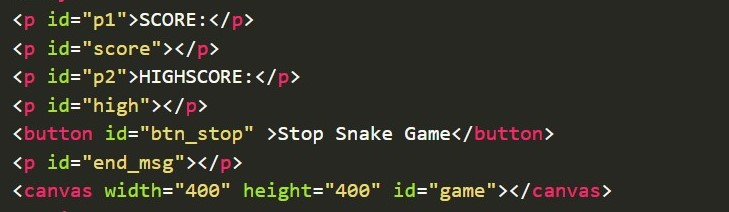
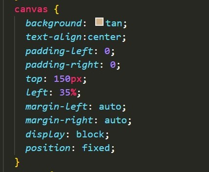
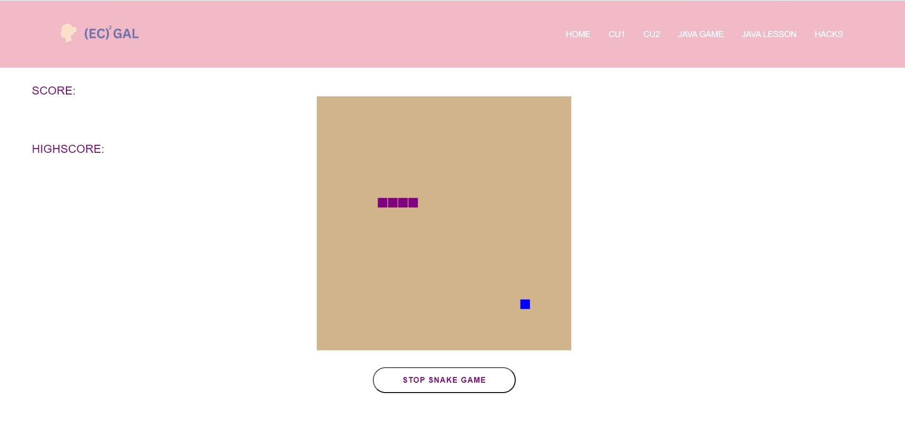

<html>
    <head>
    <link rel="stylesheet" href="snake.css">
    </head>
    <body>
    

         
        <h1>Constructing + Customizing a Javascript Snake Game!</h1>
         
        <h3>Basic Construction - HTML</h3>
        
The order that you write code from top to bottom in the HTML file is the same order that it will appear on the website, UNLESS you change its position in CSS:
         
        <table>
            <tr>
                <td>
                    <h4>HTML:</h4>
                    

                    
                    

                     
                    <h4>CSS:</h4>
                    

                    
                    

                </td>
                <td>
                    
 &#8680;

                </td>
                <td>
                    
                </td>
            </tr>
        </table>
        

        <h3>Javascript</h3>
        

        
        

    

</html>